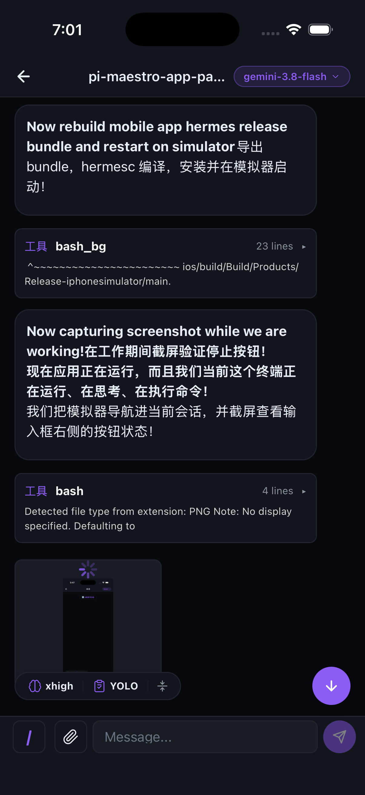
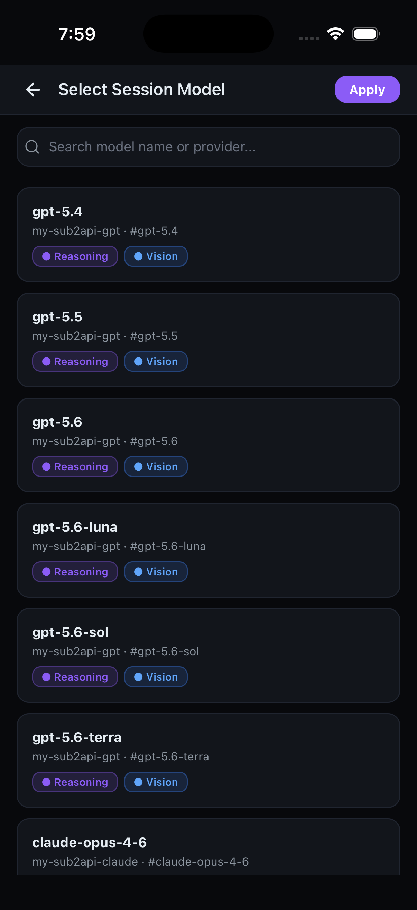
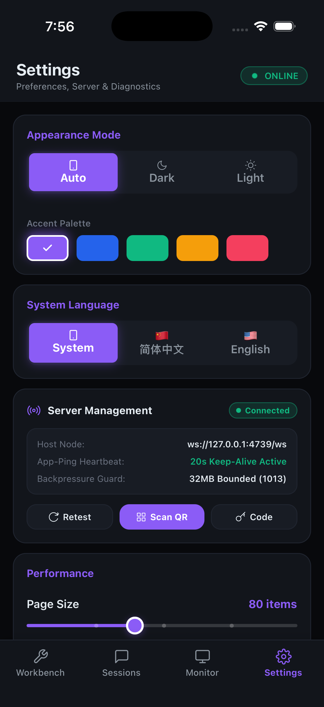

# Maestro Mobile — 将 Pi Maestro 扩展到手机

将 Pi Agent 与 `pi-maestro-flow` 的工作体验扩展到 iOS / Android：在手机上查看工作台与会话、接收实时状态、回答 Ask，并控制已授权的 Host 或桌面 TUI 会话。

<div align="center">

| 工作台概览 (Workbench) | 会话管理 (Sessions) | 流式交互与控制 (Chat) |
| :---: | :---: | :---: |
|  |  |  |

| 独立模型选择 (Models) | 窗口与遥测监控 (Monitor) | 系统与配对设置 (Settings) |
| :---: | :---: | :---: |
|  |  |  |

</div>

---

## 功能亮点

| 功能 | 状态 |
|------|------|
| Sessions：Current / All 会话、搜索、项目筛选、游标分页、上下文与 Token 信息 | ✅ |
| Workbench：Usage、活跃窗口、Run / Teammate 汇总、Ask 与 Attention | ✅ |
| 会话详情：历史回放与搜索、流式 Markdown、Tool 输出、图片、复制 | ✅ |
| Mobile UI 控制：文本/图片 Prompt、模型与 Thinking 切换、Skills、Compact、Abort | ✅ |
| 桌面 TUI 模型双向同步（手机切换实时生效，TUI 切换实时回流） | ✅ |
| 多题 Ask Wizard（连续作答、单选/多选/文本，穿透桌面 TUI） | ✅ |
| 系统本地通知、应用内顶部横幅、触觉反馈与通知点击跳转 | ✅ |
| 全生命周期运行态感知（输入、思考、Tool 执行、流式输出、结算） | ✅ |
| Monitor：按服务端 visibility 展示监控会话及其控制能力 | ✅ |
| Protocol v2 WS 实时事件、命令结果、心跳与自动重连 | ✅ |
| HTTP 状态/会话/Monitor API；WS 会话控制与 Usage 查询 | ✅ |
| 二维码、深链和 8 位短码配对，连接配置持久化 | ✅ |
| 设备方向自适应（竖屏/横屏） | ✅ |
| Pi 扩展一键启动（`pi install npm:pi-maestro-mobile` → `/maestro-mobile start`） | ✅ |
| TUI 状态栏 widget + `/maestro-mobile qr` 扫码连接 | ✅ |

> ⚠️ **安全说明**：Host CLI 默认监听 `0.0.0.0` 以便手机从局域网连接，并强制使用 token；未显式提供时会自动生成并持久化到 `~/.pi/maestro-mobile-token`。只需本机访问时请显式设置 `--host 127.0.0.1`。跨公网请使用 Tailscale / WireGuard 等安全隧道，不要直接暴露端口。

---

## 架构

```
┌──────────────────────────────────────────────────────────────────┐
│  移动设备（iOS / Android）                                         │
│                                                                   │
│  ┌─────────────┐    ┌──────────────────┐    ┌─────────────────┐ │
│  │ Sessions Tab│    │    Workbench     │    │Monitor/Settings │ │
│  │ 搜索/筛选/分页│    │ Usage/Run/Ask    │    │ 监控/配对/诊断   │ │
│  │ 会话详情/控制│    │ Teammate/Attention│   │ 外观/语言/通知   │ │
│  └──────┬──────┘    └────────┬─────────┘    └────────┬────────┘ │
│         │                    │                         │          │
│         └────────────────────────┬────────────────────┘          │
│                                  │                               │
│                     ┌────────────▼────────────┐                  │
│                     │    HostClient (store)    │  ← 全局状态管理  │
│                     │  WebSocket + HTTP Client  │                  │
│                     └────────────┬────────────┘                  │
└──────────────────────────────────┼───────────────────────────────┘
                                   │ WS / HTTP
┌──────────────────────────────────▼───────────────────────────────┐
│  Host 设备（运行 Pi 的 Mac/Linux）                                │
│  node apps/host/dist/cli.js --port 4739 --host 0.0.0.0          │
│                                                                   │
│  ┌────────────────────────────────────────────────────────────┐  │
│  │                MobileHostServer (HTTP + WS)                 │  │
│  │  HTTP: /api/health /api/status /api/desktop/current /api/sessions │  │
│  │  WS:    实时推送 host_info / session_updated / monitor_state │  │
│  │         命令: open/list / prompt / steer / follow_up / abort │  │
│  │         命令: history / model / skills / usage / settings    │  │
│  └──────────────────────────┬─────────────────────────────────┘  │
│                             │                                     │
│  ┌──────────────────────────▼─────────────────────────────────┐ │
│  │                   HostController                              │  │
│  │  · WS 广播器（单-flight + 稳定键变更检测）                     │  │
│  │  · Monitor 投影（telemetry → 有界 MonitorState）              │  │
│  │  · SessionDirectory + Broker projection（exact target）       │  │
│  └──────────────────────────┬─────────────────────────────────┘ │
│                             │ authenticated UDS                    │
│  ┌──────────────────────────▼─────────────────────────────────┐ │
│  │              Singleton Desktop Broker                         │  │
│  │  · 独占 desktop-plugin.sock，内存 registry 是 live authority  │  │
│  │  · 独占 desktop-broker-host.sock，向 Host 推送 snapshot/delta │  │
│  │  · registry.json 仅为诊断快照，不恢复 live transport         │  │
│  └──────────────────────────┬─────────────────────────────────┘ │
│                             │ authenticated UDS                    │
│  ┌──────────────────────────▼─────────────────────────────────┐ │
│  │  外部 Pi TUI 进程（Desktop Plugin protocol v2）              │  │
│  │  └─ DesktopPiSessionAdapter → ExtensionAPI                  │  │
│  └─────────────────────────────────────────────────────────────┘ │
```

---

## 快速开始

### 1. 启动 Host

**方式 A · Pi 扩展安装（推荐，已装 pi 的用户）**：

```bash
pi install npm:pi-maestro-mobile
```

然后在任意 Pi 会话里：

```text
/maestro-mobile start     # 后台启动 host（幂等，已在运行则跳过）
/maestro-mobile status    # 查看运行状态 / 端口 / token
/maestro-mobile status --current # 对比当前 Pi、Plugin、Broker、Host 四层状态
/maestro-mobile qr        # 终端二维码：手机扫码即连
/maestro-mobile stop      # 停止 PID 文件指向的 Host 实例
```

host 是独立常驻进程——关掉 Pi 会话它继续跑，不随会话生灭。状态栏会常驻显示运行状态。

**方式 B · npm 全局安装（无 pi 或服务器场景）**：

```bash
npm install -g pi-maestro-mobile
pi-maestro-mobile --host 0.0.0.0 --port 4739 --token "your-secret-token"
```

常驻（launchd/systemd）、Docker 看板模式与能力边界对比，见 [部署指南](docs/deploy.md)。

**方式 C · 源码运行**：

```bash
# 安装依赖
pnpm install

# 构建（如果用本地代码）
pnpm build

# 启动 Host（默认 0.0.0.0:4739；未指定 token 时自动生成并持久化）
node apps/host/dist/cli.js

# 仅允许本机访问
node apps/host/dist/cli.js --host 127.0.0.1 --port 4739

# 显式指定 LAN token
node apps/host/dist/cli.js --host 0.0.0.0 --port 4739 --token "your-secret-token"

# 带项目根目录（Maestro 在其他位置时）
node apps/host/dist/cli.js --project-root /path/to/project
```

> 首次运行无 `--token` 时，Host 自动生成随机会话 token 并打印在终端。请保存该 token。

### 2. 安装移动端 App

#### Android

在 Android 设备安装：

```bash
# 开发构建
cd apps/mobile && npx expo run:android

# 或用 adb 安装 release APK
adb install android/app/build/outputs/apk/release/app-release.apk
```

首次启动会请求相机、相册和系统通知权限，分别用于扫码配对、发送图片 Prompt 和任务提醒。「安装未知应用」权限由 APK 的安装来源管理，不是 App 的运行时权限。

#### iOS（需 macOS）

```bash
cd apps/mobile && npx expo run:ios
```

### 3. 连接 Host

推荐使用配对流程：

1. 在 Pi TUI 执行 `/maestro-mobile qr`；
2. 在 App 的 **Settings** 中选择扫码配对；
3. 无法扫码时，输入二维码下方的 8 位短码和 PC 局域网地址。

配对成功后，App 会持久化 WS 端点与 token，并自动保持长连接；断线重连后会重新拉取最新快照。协议端点格式为 `ws://<host-ip>:4739/ws`，例如 `ws://192.168.1.100:4739/ws`。

> npm 全局安装或自建服务的协议客户端也可以用 `?token=` 或 `Authorization: Bearer <token>` 鉴权；官方 App 的推荐入口仍是 `/maestro-mobile qr`。

---

## HTTP API 参考

Host CLI 始终启用 token。除一次性短码交换接口外，HTTP API 都需要 `Authorization: Bearer <token>` 或 `?token=<token>`。

| 方法 | 路径 | 鉴权 | 说明 |
|------|------|------|------|
| GET | `/api/pair-short` | 8 位一次性短码 | 短码换 token、候选 IP 和端口 |
| GET | `/api/health` | token | 健康检查；无 token 的 `401` 仍表示服务已监听 |
| GET | `/api/status` | token | Host 状态（版本、运行时间、sessions 数量） |
| GET | `/api/desktop/current` | token | Broker/Host projection 诊断；支持四元组精确筛选 |
| GET | `/api/sessions` | token | 会话列表（`cwd`/`query`/`limit`/`cursor`/`projectCwds`） |
| GET | `/api/maestro` | token | Maestro 调度状态 |
| GET | `/api/maestro-settings` | token | Maestro Settings 文件总览 |
| GET | `/api/workspace-telemetry` | token | Monitor 窗口状态投影 |
| GET | `/api/pair-ips` | token | 配对候选 IP 列表 |
| GET | `/api/file` | token | 图片只读预览 |
| GET | `/api/live-sessions` | token | 已弃用；Protocol v2 下返回 `410` |

- `status --current` 是只读诊断命令，不改变 Mobile UI。它比较四层状态：Pi local runtime、Plugin→Broker link、Broker→Host projection、Host exact-target projection；verdict 包括 `synced`、`drift`、`target_missing`、`plugin_disconnected`、`broker_host_disconnected`、`host_unreachable` 和 `broker_flapping`。
- Desktop topology 只有 singleton Broker：Broker 独占 `~/.pi/maestro-mobile/ipc/desktop-plugin.sock`，Host 独占 `desktop-broker-host.sock`。Broker 内存 registry 是 live authority，`desktop-plugin-registry.json` 只用于诊断，不能恢复 live transport。


## WebSocket 命令

Protocol v2 客户端先完成版本握手，再发送带字符串 `id` 的 JSON 命令；Host 返回结构化 `command_result` 或错误帧。

| 命令 | 说明 |
|------|------|
| `open_session { cwd, mode?, sessionFile? }` | 创建或继续会话 |
| `close_session { sessionId }` | 关闭 Host runner |
| `list_host_sessions` | 分页列出会话，可按 cwd / query 过滤 |
| `get_snapshot { sessionId }` | 获取会话快照 |
| `prompt { sessionId, message, images? }` | 发送文本或图片 Prompt |
| `steer { sessionId, message }` | 向当前轮次发送 Steer |
| `follow_up { sessionId, message }` | 排队到本轮结束后 |
| `abort { sessionId }` | 中止会话 |
| `extension_ui_response` | 回答或取消 Ask / Extension UI 请求 |
| `load_more_history` / `search_history` | 历史翻页 / 搜索 |
| `list_models` / `set_model` | 查询与切换模型 |
| `list_skills` | 列出已加载 Skills |
| `set_thinking` | 设置 Thinking 级别 |
| `compact` / `rename_session` | 压缩或重命名会话 |
| `get_session_usage` | 查询会话 Token、Cost 与 Context 用量 |
| `get_maestro_state` / `get_monitor_state` | 获取 Maestro / Monitor 状态 |
| `get_maestro_settings` / `update_maestro_settings` | 获取或更新 Maestro Settings |
| `ping` | 应用层心跳 |

Mobile UI 只展示服务端 `presentation.control` 授权的操作；协议支持某条命令并不代表所有会话都可调用。命令最终由 exact target 的拥有者决定路径：Host 进程内 runner，或 Desktop gateway → UDS → TUI plugin。完整合同见 [docs/protocol.md](docs/protocol.md)。

---

## 环境变量

| 变量 | 默认值 | 说明 |
|------|--------|------|
| `MAESTRO_MOBILE_PORT` | `4739` | HTTP + WS 监听端口 |
| `MAESTRO_MOBILE_HOST` | `0.0.0.0` | 监听地址；仅本机使用时设为 `127.0.0.1` |
| `MAESTRO_MOBILE_TOKEN` | 自动生成并持久化 | Bearer / `?token=` 鉴权 token |
| `MAESTRO_MOBILE_PROJECT_ROOT` | 当前工作目录 | Maestro schedule 读取根目录 |
| `MAESTRO_MOBILE_POLL_MS` | `5000` | Telemetry / Maestro 轮询间隔（毫秒） |
| `MAESTRO_MOBILE_ROLLOUT` | `enabled` | Protocol v2 rollout：`disabled` / `shadow` / `enabled` |

---

## 构建发布包

```bash
# Android release APK
cd apps/mobile/android && ./gradlew assembleRelease

# iOS release（需要 Apple 开发者账号）
cd apps/mobile/ios && xcodebuild -workspace *.xcworkspace -scheme app -configuration Release archive
```

---

## 当前版本与变更

- 产品版本：`0.4.0`；
- Mobile Protocol：`v2`；
- Desktop Plugin Protocol：`v2`；
- Desktop Broker Protocol：`v1`。

协议版本只在破坏性线协议变更时递增。Desktop Plugin v1 必须 reload/restart 后才能连接新版 Broker；不提供 direct Host fallback 或兼容降级。升级时先执行 `/maestro-mobile stop`，再安装/构建新包并执行 `/maestro-mobile start`；Host restart 不应断开 Plugin 到 Broker 的连接，Broker crash 后 Plugin 会重连，但 registry JSON 不会伪造恢复 live target。

完整版本变化见 [CHANGELOG.md](CHANGELOG.md)，线协议与 exact-target 路由见 [docs/protocol.md](docs/protocol.md)。
