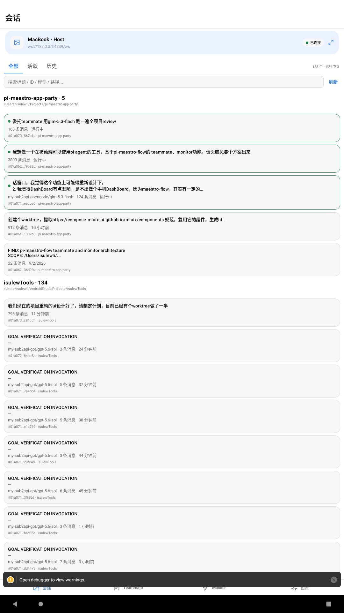
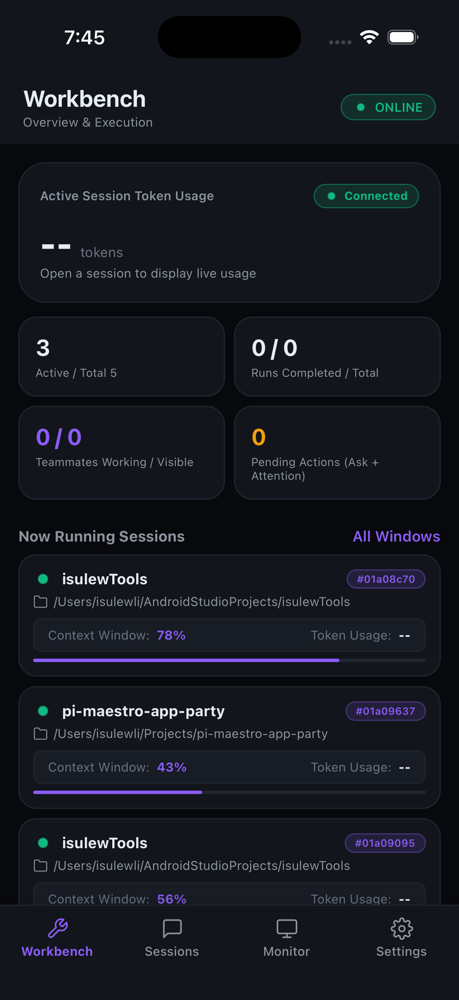
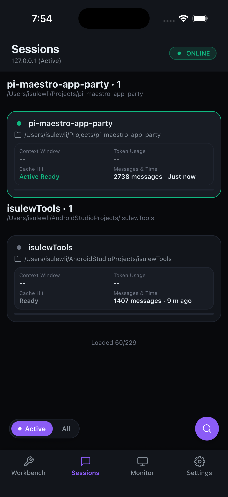
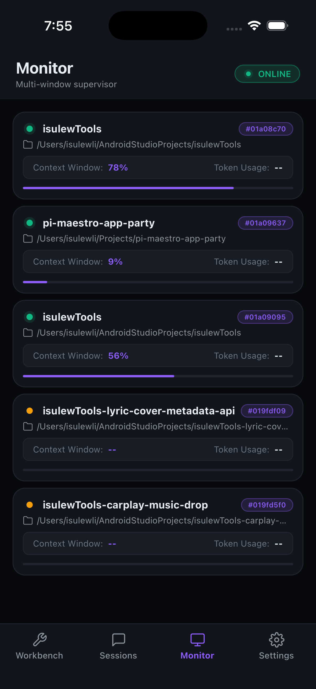
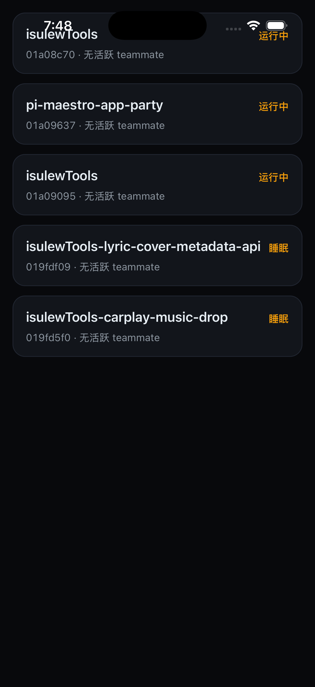

# Maestro Mobile — 将 Pi Maestro 扩展到手机

将 [pi-maestro](https://github.com/pi什么人/pi-maestro) 的 maestro 命令行体验扩展到 iOS/Android 手机，随时随地监控 AI 工作状态、查看日志、发送指令。











---

## 功能亮点

| 功能 | 状态 |
|------|------|
| 移动端监控 Pi 工作窗口（Maestro Schedule / Monitor） | ✅ |
| 查看会话日志、发送 Prompt / Steer / Abort | ✅ |
| Teammate Tab：查看 Agent 工作状态 | ✅ |
| WS 实时推送（连接/断开自动重连） | ✅ |
| HTTP API（健康检查、Maestro 设置、Usage） | ✅ |
| 设备方向自适应（竖屏/横屏） | ✅ |
| 单机单 Host（Pi Host 进程 + 移动端 App） | ✅ |

> ⚠️ **安全说明**：默认仅监听 `127.0.0.1`。使用 `--host 0.0.0.0` 对局域网开放时请务必配置 `--token`，并注意内网设备均能访问该端口。

---

## 架构

```
┌──────────────────────────────────────────────────────────────────┐
│  移动设备（iOS / Android）                                         │
│                                                                   │
│  ┌─────────────┐    ┌──────────────────┐    ┌─────────────────┐ │
│  │ HostSessions│    │  Dashboard  监控  │    │  Teammate Tab   │ │
│  │ Tab  会话   │    │  Maesto Schedule │    │  Agent 详情     │ │
│  │ 列表/操作   │    │  实时推送窗口    │    │                 │ │
│  └──────┬──────┘    └────────┬─────────┘    └────────┬────────┘ │
│         │                    │                         │          │
│         └────────────────────────┬────────────────────┘          │
│                                  │                               │
│                     ┌────────────▼────────────┐                  │
│                     │    HostClient (store)    │  ← 全局状态管理  │
│                     │  WebSocket + HTTP Client  │                  │
│                     └────────────┬────────────┘                  │
└──────────────────────────────────┼───────────────────────────────┘
                                   │ WS / HTTP
┌──────────────────────────────────▼───────────────────────────────┐
│  Host 设备（运行 Pi 的 Mac/Linux）                                │
│  node apps/host/dist/cli.js --port 4739 --host 127.0.0.1        │
│                                                                   │
│  ┌────────────────────────────────────────────────────────────┐  │
│  │                MobileHostServer (HTTP + WS)                 │  │
│  │  HTTP: /api/health /api/status /api/sessions /api/maestro   │  │
│  │  WS:    实时推送 host_status / monitor_state / maestro_state│  │
│  │         命令: list_host_sessions / prompt / steer / abort   │  │
│  │         命令: get_monitor_state / get_maestro_settings      │  │
│  └──────────────────────────┬───────────────────────────────────┘  │
│                             │                                     │
│  ┌──────────────────────────▼───────────────────────────────────┐ │
│  │                   HostController                              │  │
│  │  · WS 广播器（单-flight + 稳定键变更检测）                     │  │
│  │  · Monitor 投影（telemetry → 有界 MonitorState）              │  │
│  │  · MaestroSchedule 读取 / MaestroSettings / Session 生命周期    │  │
│  └───────────────────────────────────────────────────────────────┘ │
│                             │                                     │
│  ┌──────────────────────────▼───────────────────────────────────┐ │
│  │              WorkspaceTelemetryReader                         │  │
│  │  ~/.pi/teammate/workspaces/<id>/runtime/owners/*.json       │  │
│  └───────────────────────────────────────────────────────────────┘ │
└───────────────────────────────────────────────────────────────────┘
```

---

## 快速开始

### 1. 启动 Host

**方式 A · npm 全局安装（推荐）**：

```bash
npm install -g pi-maestro-host
maestro-mobile-host --host 0.0.0.0 --port 4739 --token "your-secret-token"
```

常驻（launchd/systemd）、Docker 看板模式与能力边界对比，见 [部署指南](docs/deploy.md)。

**方式 B · 源码运行**：

```bash
# 安装依赖
pnpm install

# 构建（如果用本地代码）
pnpm build

# 启动 Host（默认 127.0.0.1:4739）
node apps/host/dist/cli.js

# LAN 开放（建议同时指定 token）
node apps/host/dist/cli.js --host 0.0.0.0 --port 4739 --token "your-secret-token"

# 带项目根目录（Maestro 在其他位置时）
node apps/host/dist/cli.js --project-root /path/to/project
```

> 首次运行无 `--token` 时，Host 自动生成随机会话 token 并打印在终端。请保存该 token。

### 2. 安装移动端 App

#### Android

在 Android 设备安装：

```bash
# 开发构建
cd apps/mobile && npx expo run:android

# 或用 adb 安装 release APK
adb install android/app/build/outputs/apk/release/app-release.apk
```

首次启动时会请求「安装未知应用」权限。

#### iOS（需 macOS）

```bash
cd apps/mobile && npx expo run:ios
```

### 3. 连接 Host

在 App 首页填写：

- **URL**: `http://<host-ip>:4739`（如 Host 在 `192.168.1.100`，填 `http://192.168.1.100:4739`）
- **Token**: 启动时终端显示的 token（或你自己指定的 `--token`）

点击「连接」，App 自动保持长连接。Host 端实时推送 Monitor 状态，App 离线重连后自动拉取最新快照。

---

## HTTP API 参考

| 方法 | 路径 | 鉴权 | 说明 |
|------|------|------|------|
| GET | `/api/health` | 否 | 健康检查 |
| GET | `/api/status` | token | Host 状态（版本/运行时间/sessions 数量） |
| GET | `/api/sessions` | token | 所有 Pi 会话列表 |
| GET | `/api/sessions/:id/snapshot` | token | 会话快照（timeline + metadata） |
| GET | `/api/maestro/schedule` | token | Maestro Schedule（所有 Run） |
| GET | `/api/maestro/settings` | token | Maestro Settings 文件 |
| PATCH | `/api/maestro/settings` | token | 更新 Settings |
| GET | `/api/maestro/usage` | token | Usage 聚合（今日/本周/本月） |
| GET | `/api/workspace-telemetry` | token | Monitor 窗口状态（原始 telemetry） |
| GET | `/api/live-sessions` | token | 实时活跃会话（带 heartbeat） |

---

## WebSocket 命令

连接后发送 JSON 命令，Host 响应后返回 `ack` 或 `error`。

| 命令 | 说明 |
|------|------|
| `list_host_sessions` | 列出所有会话 |
| `list_live_sessions` | 列出活跃会话 |
| `get_monitor_state` | 获取 Monitor 窗口状态 |
| `get_snapshot { sessionId }` | 获取会话快照 |
| `prompt { sessionId, message }` | 发送 Prompt |
| `steer { sessionId, message }` | 发送 Steer |
| `steer_window { endpointId, cwd, message }` | 跨窗口监督发送 |
| `abort { sessionId }` | 中止会话 |
| `get_maestro_settings` | 获取 Maestro Settings |
| `update_maestro_settings { patch }` | 更新 Settings |
| `list_models { sessionId }` | 列出可用模型 |
| `list_skills { sessionId }` | 列出可用 Skills |
| `set_model { sessionId, modelId }` | 切换模型 |
| `set_thinking { sessionId, level }` | 设置 Thinking 级别 |
| `compact_session { sessionId, customInstructions? }` | 压缩会话 |
| `rename_session { sessionId, name }` | 重命名会话 |

---

## 环境变量

| 变量 | 默认值 | 说明 |
|------|--------|------|
| `MAESTRO_MOBILE_PORT` | `4739` | HTTP 监听端口 |
| `MAESTRO_MOBILE_HOST` | `127.0.0.1` | 监听地址 |
| `MAESTRO_MOBILE_TOKEN` | 无（自动生成） | 会话 token |
| `MAESTRO_MOBILE_POLL_MS` | `5000` | 轮询间隔（毫秒） |

---

## 构建发布包

```bash
# Android release APK
cd apps/mobile/android && ./gradlew assembleRelease

# iOS release（需要 Apple 开发者账号）
cd apps/mobile/ios && xcodebuild -workspace *.xcworkspace -scheme app -configuration Release archive
```

---

## 发布说明（v1.0.0）

**修复的安全与稳定性问题**：

- ✅ **HIGH**: 稳定键变更检测（消除无变化的 5s 冗余 WS 广播）
- ✅ **HIGH**: WS single-flight 防轮询重叠
- ✅ **HIGH**: outputTail / agents / backgroundJobs 有界截断（WS 广播不再无界）
- ✅ **HIGH**: 共享投影器独立模块（推送与查询共用同一投影，消除漂移）
- ✅ **HIGH**: TeammateAgentState / TeammateAgentsFacet / MonitorFacet 类型化
- ✅ **HIGH**: get_monitor_state 与 WS 推送共用投影（contextPressure 不再丢失）
- ✅ **MEDIUM**: WS maxPayload 8MB + 连接数上限 32 + per-client in-flight 命令上限 8
- ✅ **MEDIUM**: 默认绑定 127.0.0.1（显式 `--host 0.0.0.0` 才对 LAN 开放）
- ✅ **MEDIUM**: 图片接口 stat 前置（防超大文件 OOM）
- ✅ **MEDIUM**: 连接代次防护（旧 socket 回调不接管新连接状态）
- ✅ **MEDIUM**: 退避需稳定连接 30s 才清零（防握手后反复断开退化）
- ✅ **MEDIUM**: token URL 拼接用 searchParams（url 含 query 参数时正确工作）
- ✅ **MEDIUM**: liveMessageKey 缺 timestamp 消息不再统一归 0（避免 timeline 丢消息）
- ✅ **MEDIUM**: host_info reducer case（版本元数据实际生效）
- ✅ **MEDIUM**: publishedAt NaN 跳过（alive/sort 可靠性）
- ✅ **MEDIUM**: version-detector require 对象强转修复
- ✅ **MEDIUM**: usage token/cost 非负校验
- ✅ **复查**: 稳定键改用有界投影确定性 JSON（覆盖全部投影字段，消除漏广播）
- ✅ **复查**: get_monitor_state 运行时校验（防异常/恶意载荷）

**测试覆盖**: 192 测试全绿（host 99 / mobile 81 / shared 12）
